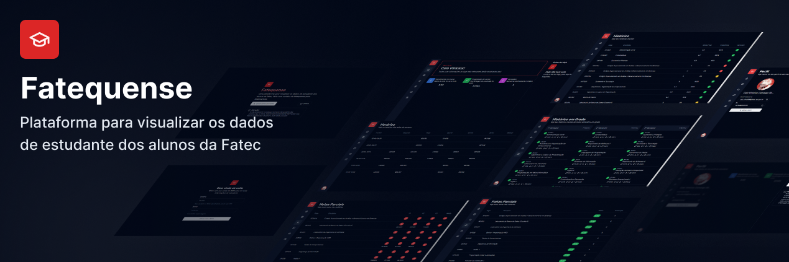

Fatequense é uma plataforma para que os estudantes das Fatecs possam ter uma melhor experiência ao visualizar suas informações

## 🔎 Observações
- A aplicação pode dar problema a qualquer momento caso haja mudanças significativas no site do SIGA.
- A aplicação pode ser utilizada apenas por contas de estudantes da Fatec.

## 🔥 Tecnologias

- [ReactJS](https://react.dev)
- [NextJS](https://nextjs.org)
- [NextAuth](https://next-auth.js.org)
- [TailwindCSS](https://tailwindcss.com)
- [JWT](https://jwt.io)
- [Shadcn UI](https://ui.shadcn.com/)