# 🏫 Fatequense

Plataforma para visualizar os dados de estudante dos alunos da Fatec

## 🔎 Observações

- A aplicação pode dar problema a qualquer momento caso haja mudanças significativas no site do SIGA.
- A aplicação pode ser utilizada apenas por contas de estudantes da Fatec.

## 🔥 Tecnologias

- [ReactJS](https://react.dev)
- [NextJS](https://nextjs.org)
- [NextAuth](https://next-auth.js.org)
- [TailwindCSS](https://tailwindcss.com)
- [JWT](https://jwt.io)
- [Shadcn UI](https://ui.shadcn.com/)

## 🖼️ Telas

### Página inicial
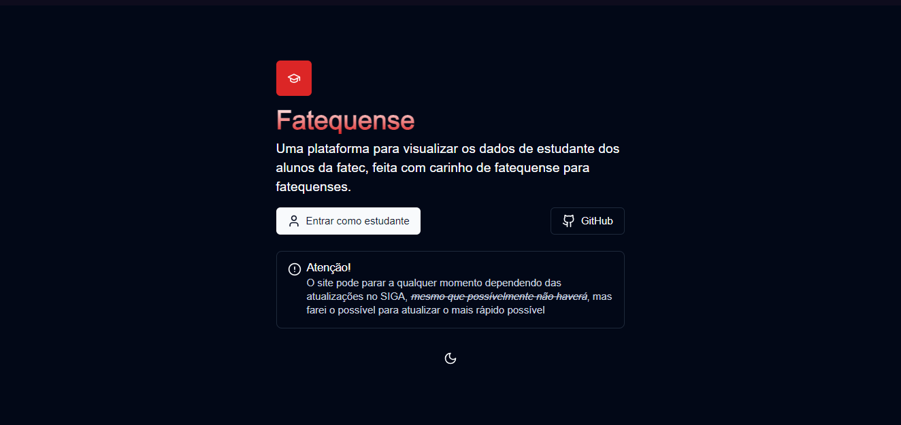
### Página de login 
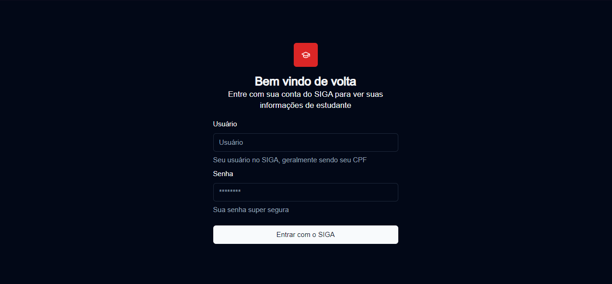
### Página home do estudante
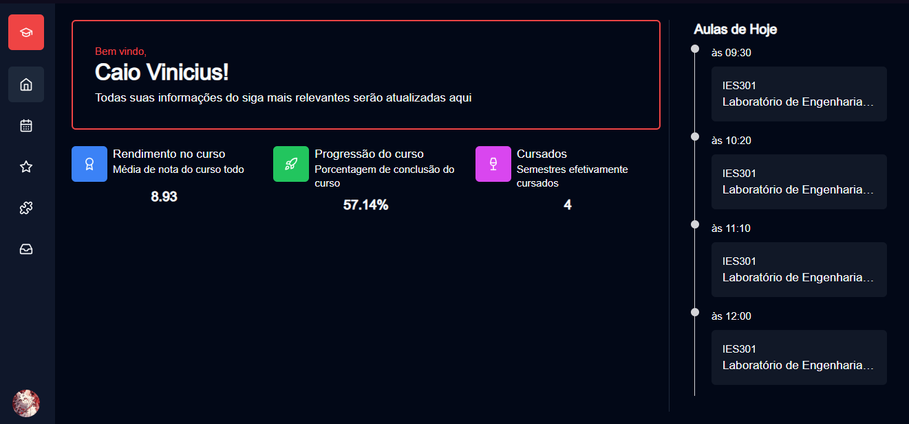
### Página de horários do estudante
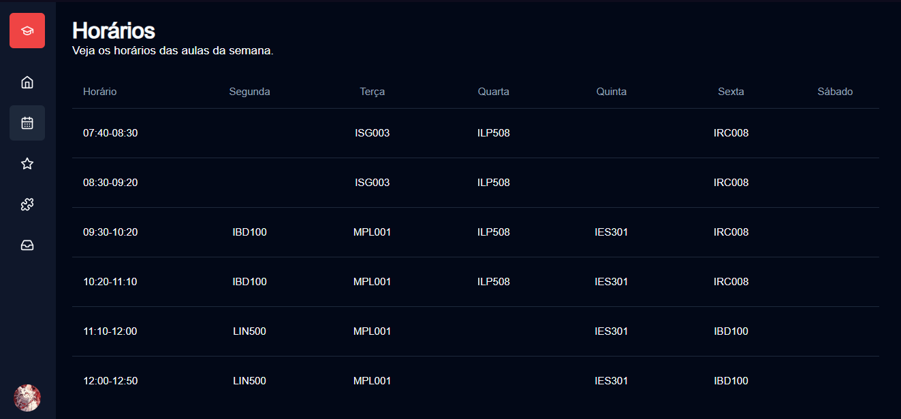
### Página de notas do estudante
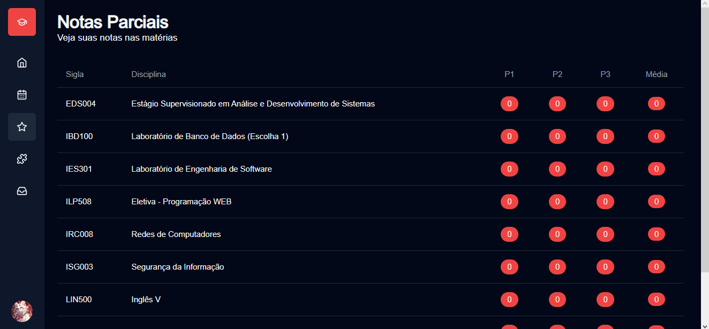
### Página de faltas do estudante
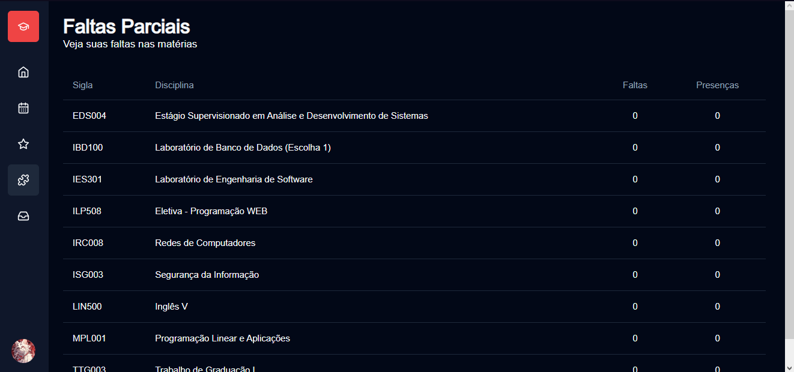
### Página de histórico do estudante
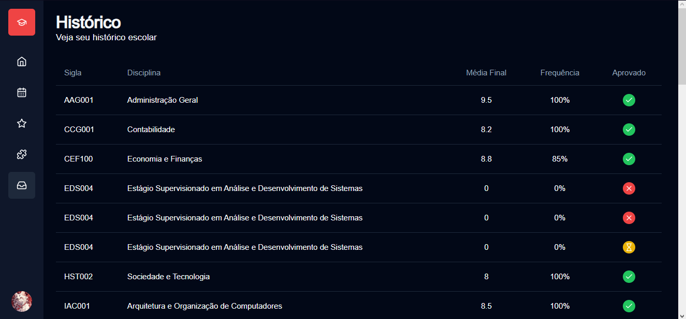

### Página de perfil do estudante
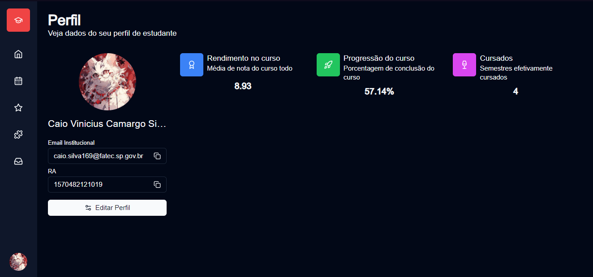

### Página de perfil do estudante (editar perfil)
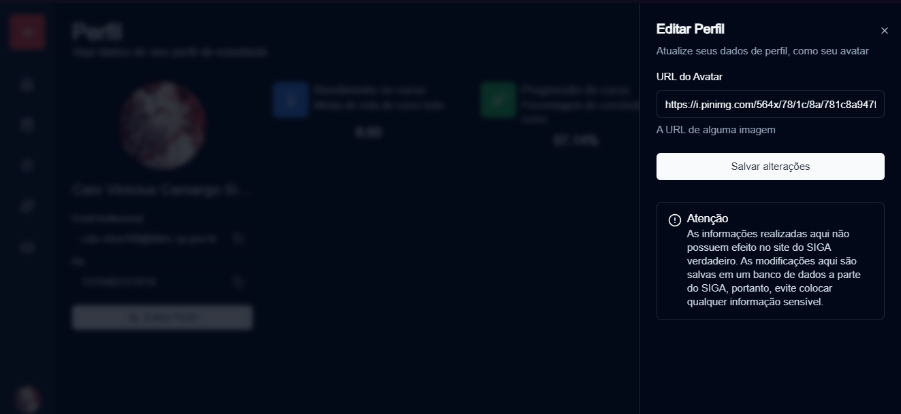

### Página de home do estudante (mobile)
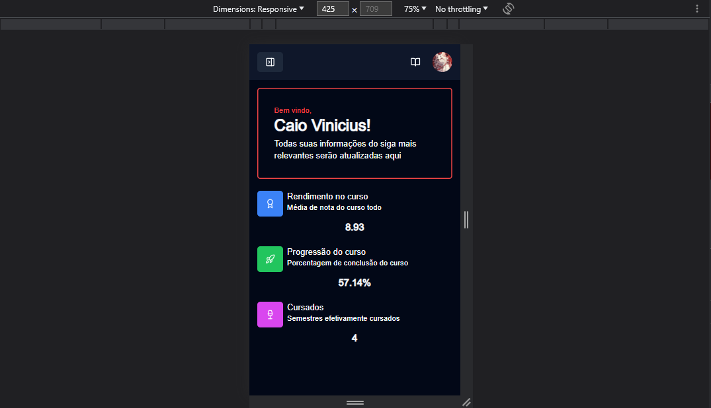

### Página de home do estudante (barra lateral no mobile)
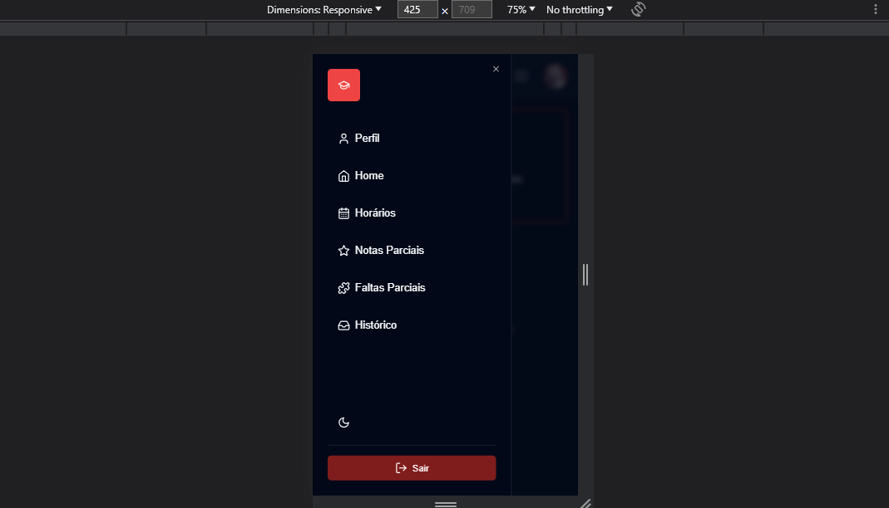

### Página de home do estudante (aulas de hoje no mobile)
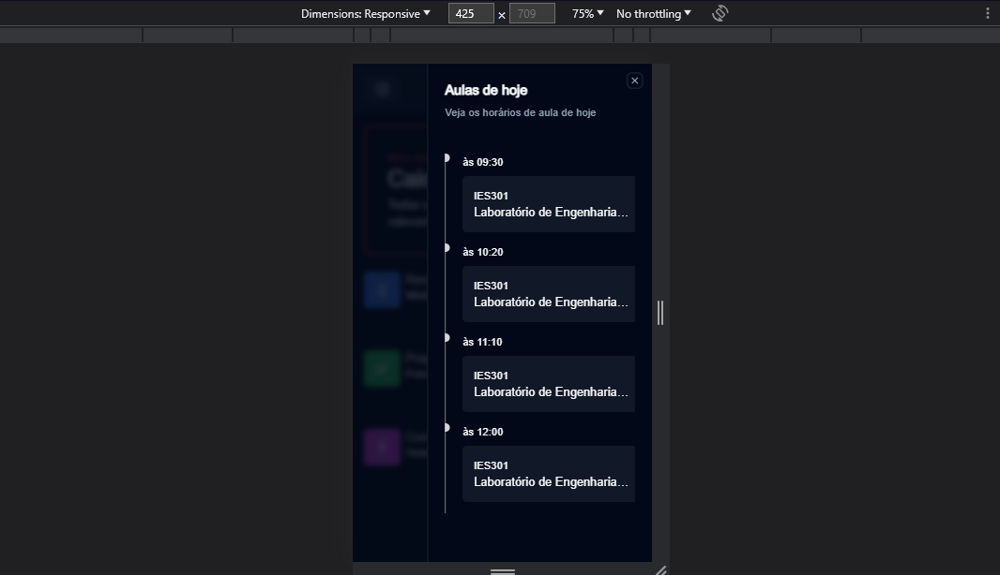